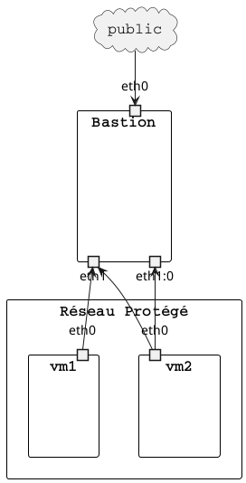

lecontesteur.Bastion
==========================

Configure un bastion pour isoler une infrastructure de test du monde extèrieur.



Requirements
------------

No Requirements

Role Variables
--------------

**bastion_internal_ip_eth1**: Ip de l'interface protégé
**bastion_internal_ip_eth1_0**: Deuxième IP de l'interface
**bastion_public_port_rules**: Liste des correspondances entre un port publique et une adresse protégée

```
  - name: Nome de la règle
    port: Port publique
    target_ip: Ip de la machine protégée
    target_port: Port du service de la machine protégée
```

**bastion_internal_service_port_rules**: Liste des correspondances entre un port protégé et une adresse protégée

```
  - name: Nome de la règle
    port: Port protégé
    target_ip: Ip de la machine publique
    target_port: Port du service de la machine publique
```

**bastion_internal_service_ip_rules**: Liste des correspondances entre une adresse protégé et une adresse publique

```
  - name: Nom de la règle
    ip: Ip protégé du bastion
    target_ip: Ip de la machine publique
    ports: Port autorisé
      - 80
      - 443
```

### Exemple

```
bastion_internal_ip_eth1: 1.1.1.254
bastion_internal_ip_eth1_0: 1.1.1.253
bastion_public_port_rules:
  - name: http
    port: 10000
    target_ip: 1.1.1.9
    target_port: 80
bastion_internal_service_port_rules:
  - name: windows active direcory 2019 - No SSL
    port: 5000
    target_ip: Y.Y.Y.Y
    target_port: 389
bastion_internal_service_ip_rules:
  - name: name.fr
    ip: Y.Y.Y.Y
    target_ip: X.X.X.X
    ports:
      - 80
      - 443
```

Dependencies
------------

No dependencies

Example Playbook
----------------


    - hosts: bastions
      roles:
         - name: bastion
           bastion_internal_ip_eth1: 1.1.1.254
           bastion_internal_ip_eth1_0: 1.1.1.253
           bastion_public_port_rules:
           - name: http
             port: 10000
             target_ip: 1.1.1.9
             target_port: 80
           - name: https
             port: 11000
             target_ip: 1.1.1.9
             target_port: 443
           bastion_internal_service_port_rules:
             - name: windows active direcory 2019 - No SSL
               port: 5000
               target_ip: 192.168.122.1
               target_port: 389
             - name: windows active direcory 2019 - With SSL
               port: 5001
               target_ip: 192.168.122.1
               target_port: 636
             - name: Cisco EST Server
               port: 5002
               target_ip: 192.168.122.1
               target_port: 8443
           bastion_internal_service_ip_rules:
             - name: name.fr
               ip: 1.1.1.9
               target_ip: 192.168.122.1
               ports:
                 - 80
                 - 443

License
-------

BSD

Author Information
------------------

https://github.com/LeConTesteur/Bastion
